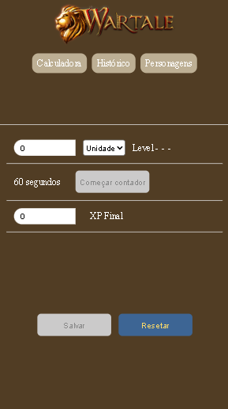

# Wartale XP Calculator 🎮📈

An experience (XP) calculator for the **Wartale** server of the game **Priston Tale**.  
With it, players can estimate how long it will take to reach a certain level based on their current XP performance in the field.

The APP is actually online and hosted on my personal AWS infrastructure:
https://wartale-xp-calculator.danieltostes.dev/

## ✨ Features

- Estimated time calculation to level up.
- 60-second timer with sound alert to record XP yield.
- Character data storage and reuse to avoid manual re-entry.
- User-friendly interface developed with React.

## 🧑‍💻 Technologies

- [ReactJS](https://reactjs.org/)
- [TypeScript](https://www.typescriptlang.org/)
- [Styled Components](https://styled-components.com/)
- [Docker](https://www.docker.com/) / [Podman](https://podman.io/) for containerization and application execution
- [AWS](https://aws.amazon.com/) — the app is hosted on an EC2 instance
- [PM2](https://pm2.keymetrics.io/) for process management
- [serve](https://www.npmjs.com/package/serve) to serve the built React app
- [Nginx](https://www.nginx.com/) as a reverse proxy
- [Certbot](https://certbot.eff.org/) for HTTPS certificate generation and renewal

## 🕹️ Who is this project for?

Built for players of **Wartale**, an alternative server of the classic MMORPG **Priston Tale**, who want to optimize their leveling time.

## ☁️ Infrastructure

The project is hosted on an **Amazon Web Services (AWS) EC2** instance and has automated CI/CD configured using GitHub Actions for deployment.

## 📦 Installation and Execution

To run the project locally, you’ll need **Docker** or **Podman** installed on your machine. All application dependencies are managed inside the container.

### Steps to Run

1. Clone this repository:

   ```bash
   git clone https://github.com/your-username/wartale-xp-calculator.git
   cd wartale-xp-calculator

2. Run the container:

- If you're using Docker:
  ```
  ./run-container-docker.sh
  ```
- If you're using Podman:

  ```
  ./run-container-podman.sh
  ```

  Depending on your operating system, you might need to make the script executable:

  ```
  chmod +x ./run-container-{podman | docker}.sh
  ```
